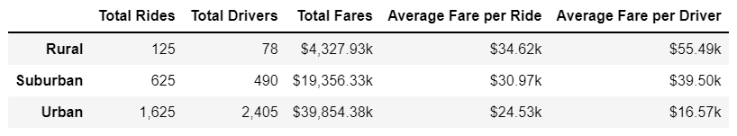
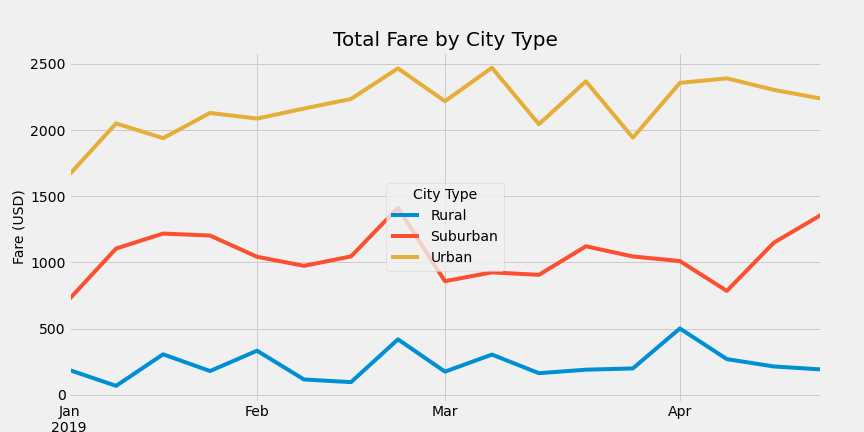

# PyBer_Analysis

## Overview of the Project

We have just joined PyBer, a Python-based ride-sharing app, and our first assignment is to analyze large sets of ride-sharing data and create vizualizations to showcase the relationship between the type of city, the number of drivers and riders as well as percentages of fares, riders and drivers by type of city. We have impressed the CEO with our initial analysis and we have now been tasked with creating a summary of key metrics by type of city and a multiple-line graph to show the total weekly fares by city type. This new analysis will help PyBer improve access to ride-sharing services and determine affordability for under-served neighborhoods.

## Results

Our new DataFrame for each city type returns the following results:

We can easily see that the number of drivers in rural areas is much lower than in suburban and urban areas (31 times and 6 times lower respectively) which creates a lack of competition in those areas and inflates fares for the customer. Average fares per driver in rural areas are 40% and 235% higher than in suburban and urban areas respectively. Ultimately this situation is not only detrimental to customers, but also represents an untapped revenue opportunity / loss of profit for PyBer. Revenue generated from rural areas only accounts for 7% of the total.

 

## Summary and Recommendations
